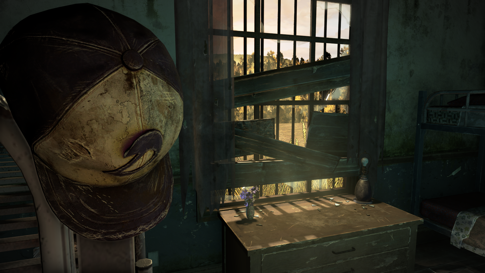
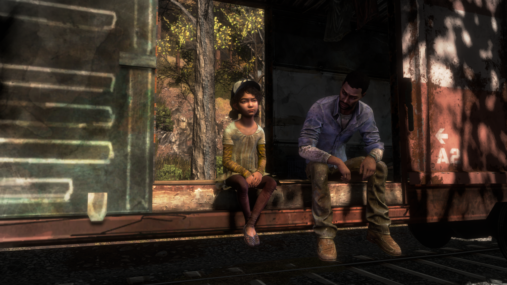
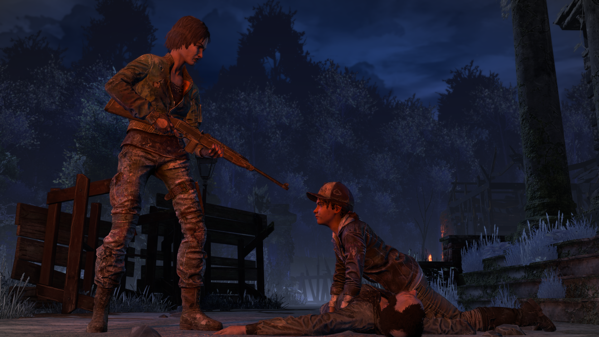

# No Outlines for Definitive Edition

### [Download the Mod here](https://github.com/frostbone25/TTDS-NoOutlines/releases)

### Install this mod using the [Telltale Mod Launcher](https://github.com/Telltale-Modding-Group/TelltaleModLauncher).

## DISCLAIMER

**This only works for 'The Walking Dead Telltale Definitive Edition'.**

## About

**This is No Outlines mod for S4 (The Walking Dead Telltale Definitive Edition)**

This mod removes outlines, inklines, graduated color filters, and graphic black from Season 4 for a more natrualistic style.

## Download

**[Download the mod](https://github.com/frostbone25/TTDS-NoOutlines/releases)**

**This mod is compatible with the [Telltale Mod Launcher](https://github.com/Telltale-Modding-Group/TelltaleModLauncher) and can be installed using the tool.**

## Comparison

**Origianl (Without Mod)**

**Enabled (With Mod)**

## Showcase

## Editing/Modifying

***For Modders/Developers Only***

**You are free to download the source code and edit/use it as you wish using the [Telltale Script Editor](https://github.com/Telltale-Modding-Group/Telltale-Script-Editor)!** You can even fork this repository to create your own version of this mod. *Just note to be mindful and edit the .tsproj file to change the author to your name and not mine in notepad or another text editor.*

To Edit/Modify this project, be sure to either download this repository or go to the releases tab and download the "Source code.zip" file. Then extract and open the project using the [Telltale Script Editor](https://github.com/Telltale-Modding-Group/Telltale-Script-Editor) and edit the code as you wish!

NOTE: This project was built using the [Telltale Script Editor Alpha 1.1.0](https://github.com/Telltale-Modding-Group/Telltale-Script-Editor)
